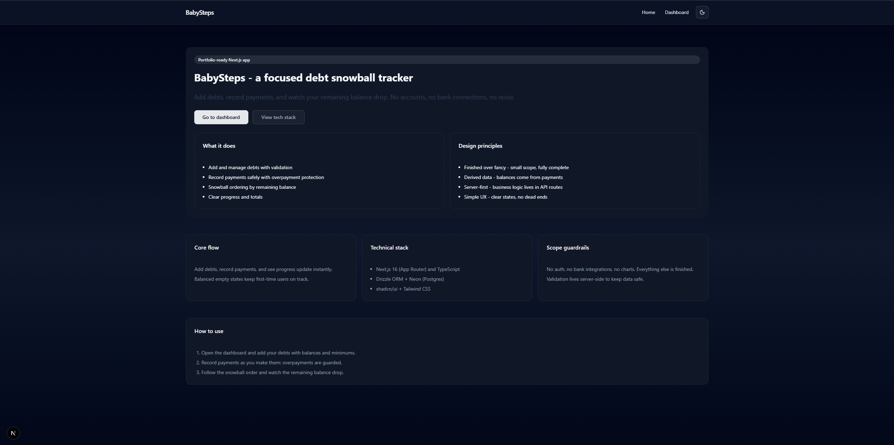
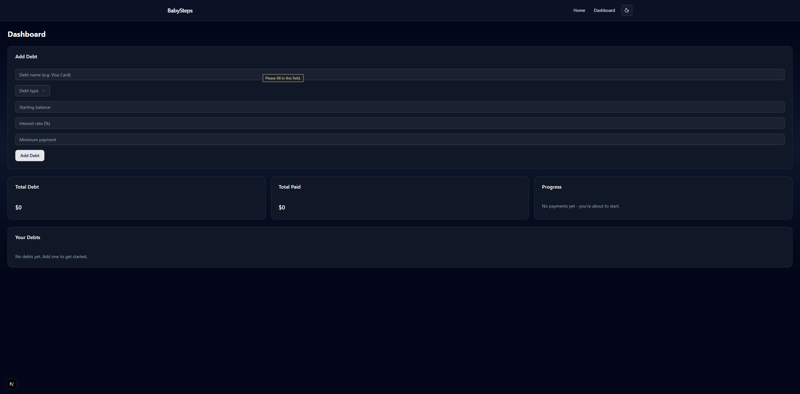
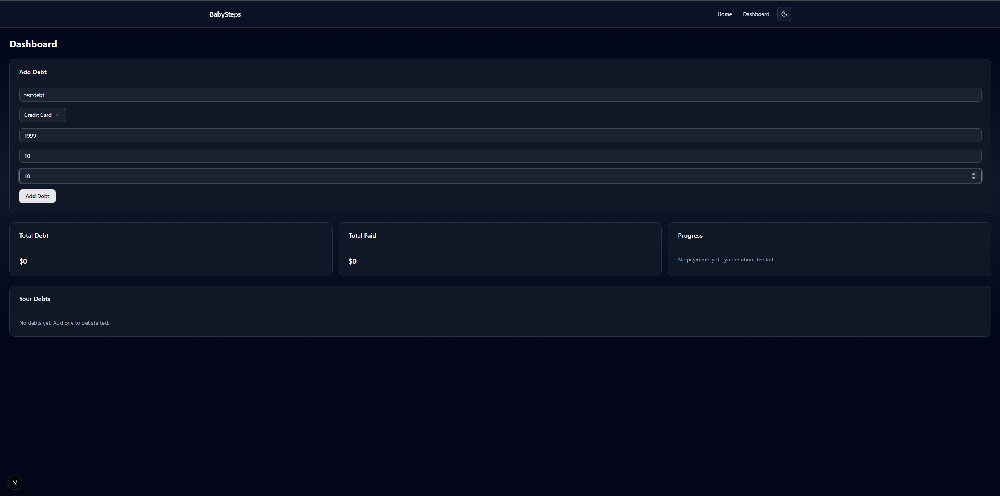
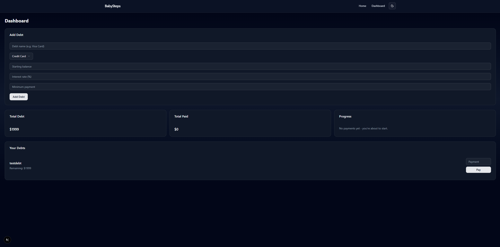
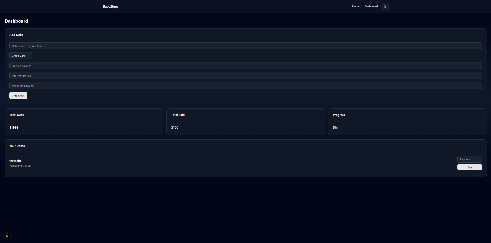

# BabySteps – Budget Micro

A minimal budgeting, income, and debt-snowball tracker that is production-ready, not a demo.

Flow: add debts → record payments → add incomes → track progress and monthly cash.

---

## What it does

- Add and manage debts (cards, loans, finance, arrears, CCJs, more)
- Record payments with overpayment protection
- Add income sources (hourly, net monthly, gross yearly, UC)
- Estimate take-home + UC taper to show household cash
- Snowball ordering and clear payoff progress
- Email-based auth with verification, reset, welcome flows

No bank connections. No fluff.

---

## Design principles

- Finished over fancy — small scope, fully complete
- Derived data — balances & income outputs are calculated, not duplicated
- Server-first — backend logic lives in API routes
- Simple UX — clear states, no dead ends

---

## Tech stack

- Next.js 16 (App Router) + TypeScript
- Drizzle ORM (Postgres via Neon)
- better-auth + mailer (Mailpit locally)
- shadcn/ui + Tailwind CSS

---

## Core features

- Debts: create, edit, delete; validate payments against remaining balance
- Payments: snowball sorting (high/low/snowball), monthly paid tracker
- Income: hourly / net monthly / gross yearly / UC; take-home estimation; UC taper calc
- Expenses: monthly categories with totals and net cashflow
- Auth: email sign-up, verification, sign-in, reset password (no social yet)
- UX: empty states, loading states, inline errors, mobile-friendly nav

---

## Out of scope (by design)

- Bank integrations
- Full budgeting categories (coming later)
- Charts/analytics dashboards
- AI recommendations
- Import/export

---

## Running locally

```bash
# install dependencies
npm install

# run dev server
npm run dev
```

Environment variables (`.env` or export):

```
DATABASE_URL=your_neon_postgres_url
MAILPIT_HOST=127.0.0.1
MAILPIT_PORT=1025
MAIL_FROM="BabySteps <no-reply@babysteps.test>"
BETTER_AUTH_URL=http://localhost:3000
BETTER_AUTH_SECRET=your_random_secret

# Income taper (optional, defaults shown)
UC_BASE_MONTHLY=0
UC_TAPER_DISREGARD=411
UC_TAPER_RATE=0.55
```

Utilities:

- Seed demo data for the test user: `npm run seed:test`
- Run tests (non-auth): `npm test`

---

## Screenshots

Captured and saved in `./screenshots`:

- `welcome.png`
- `dashboard-empty.png`
- `add-debt.png`
- `dashboard-with-debts.png`
- `add-payment.png`

Embed preview:

```





```

---

## Known limitations

- No social login yet (email flows only)
- No historical analytics/graphs yet
- Optimised for clarity, not scale

---

## Why this project exists

This project was built to demonstrate:

- end-to-end product delivery
- clean backend modelling
- safe validation and data handling
- a complete, shippable feature set

It is intentionally small — and intentionally finished.

---

## Final checklist

- README exists and reads calmly
- `screenshots` folder exists
- App runs cleanly
- No TODOs in the UI
- Errors are human-readable
- No screen feels dead

When all are checked: stop. Do not add features. This project is complete.
